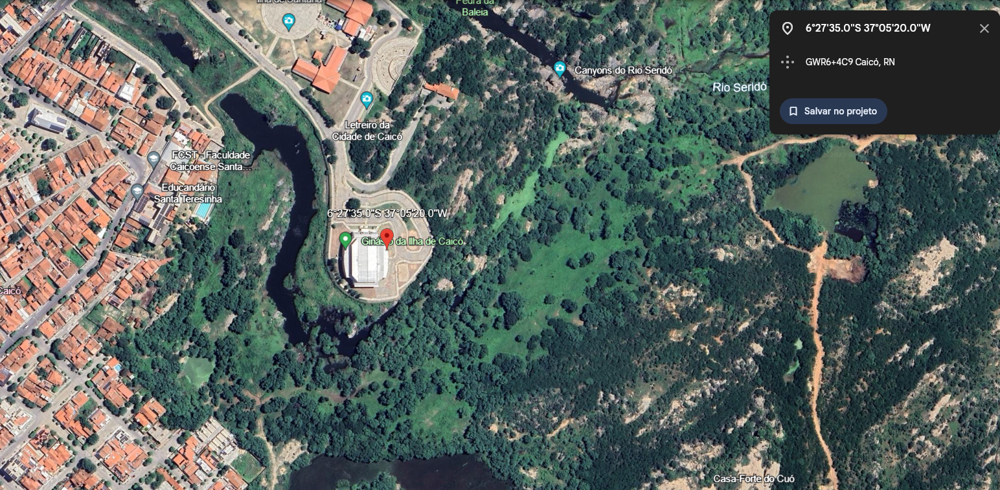
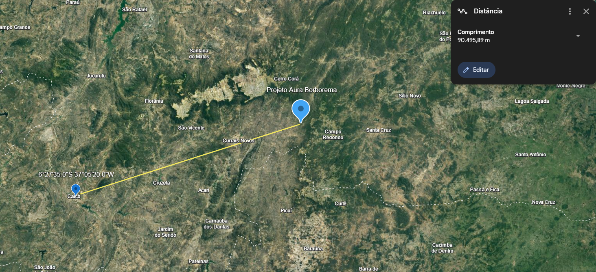

```{r, include=FALSE}
library(plotly)
library(DT)
library(lubridate)
```

```{r, include=FALSE}
dados_Anuais <- c("Ano","PRECIPITAÇÃO.MEDIA", "PRECIPITAÇÃO.TOTAL")


#dados_AnuaisMes <- c("mes","PRECIPITAÇÃO.MEDIA", "PRECIPITAÇÃO.TOTAL")

dados_AnuaisMes <- data.frame(mes = character(),
                    PRECIPITACAO.TOTAL = numeric(),
                    stringsAsFactors = FALSE)


adicionar_ano_dados_anuais <- function(dados_agregados_mes, ano) {
  # Filtrar os dados do ano específico
  dados_ano_especifico <- subset(dados_agregados_mes, grepl(ano, AnoMes))
  
  # Calcular a média e o total anual de precipitação
  media_anual_especifica <- mean(dados_ano_especifico$`PRECIPITAÇÃO.TOTAL..HORÁRIO..mm.`, na.rm = TRUE)
  total_anual_especifico <- sum(dados_ano_especifico$`PRECIPITAÇÃO.TOTAL..HORÁRIO..mm.`, na.rm = TRUE)
  
  # Criar um dataframe com os valores do ano específico
  dados_ano <- data.frame(Ano = ano, MediaAnual = media_anual_especifica, TotalAnual = total_anual_especifico)
  
  # Adicionar os valores ao dataframe dados_Anuais
  dados_Anuais <- rbind(dados_Anuais, dados_ano)
  
  # Extrair apenas o ano do formato AnoMes
  dados_agregados_mes$Ano <- substr(dados_agregados_mes$AnoMes, 1, 4)


  
  return(dados_Anuais)
}

adicionarDadosMensais <- function(dados_agregados_mes, dados_AnuaisMes) {
  # Agregar os dados mensais sem modificar o dataframe original
  dados_agregados <- aggregate(PRECIPITAÇÃO.TOTAL..HORÁRIO..mm. ~ AnoMes, dados_agregados_mes, sum)
  
  # Criar um novo dataframe que contém os dados atuais e os dados agregados
  dados_AnuaisMes <- rbind(dados_AnuaisMes, dados_agregados)
  
  return(dados_AnuaisMes)
}

dados_acima_de_10mm <- data.frame(Data = as.Date(character()), PRECIPITACAO = numeric())
```

# Dados de precipitação de Caicó

Os dados de precipitação desempenham um papel fundamental em projetos de engenharia na região, fornecendo informações essenciais para o planejamento e a implementação de diversas infraestruturas. Na área da construção civil, esses dados são vitais para dimensionar estruturas de drenagem e sistemas de saneamento, garantindo a eficiência na gestão de águas pluviais e prevenindo inundações. Além disso, na agricultura e na gestão de recursos hídricos, a compreensão detalhada dos padrões de precipitação é crucial para o desenvolvimento de práticas de irrigação eficientes e para a tomada de decisões relacionadas ao uso sustentável da água na região. Em suma, os dados de precipitação são a base para o planejamento e a execução de projetos de engenharia, contribuindo significativamente para a resiliência e a sustentabilidade das iniciativas na área.

------------------------------------------------------------------------

### Dados

Os dados foram obtidos em <https://portal.inmet.gov.br> Se referem a estação meteorologica em Caicó, a imprecisão dos dados é esperada de alguma forma, mas os valores são aproximados. Os anos de 2019 para baixo são os de maior precisão.

### Local de coleta e distância

O local da coleta dos dados fica em 6°27'35.0"S 37°05'20.0"W, na cidade Caicó, RN



A cidade fica a cerca de 90km do nosso projeto em Projeto Aura Borborema, como medido na imagem por satélite:\


------------------------------------------------------------------------

## Dados Anuais

Aqui estão um gráfico da média de precipitação mensal com base nos dados de Janeiro de 2012 até Novembro de 2023. Os mesmos estão em uma versão interativa ao final desse documento, no tópico Resultados.


[](#Resultados%20Anuais)


------------------------------------------------------------------------

# 2023

Os valores de 2023 não parecem estarem normalizados, estão aqui apenas de maneira ilustrativa.

```{r, echo=FALSE}

# Ler o arquivo CSV com a codificação especificada
dados <- read.csv2('Dados/INMET_NE_RN_A316_CAICO_01-01-2023_A_30-11-2023.CSV', skip = 8, header = TRUE, fill = TRUE, na.strings = c("", "NA"), fileEncoding = "latin1")


# Selecionar as colunas "Data", "Hora UTC" e "PRECIPITAÇÃO TOTAL"
dados_selecionados <- dados[, c("Data", "Hora.UTC", "PRECIPITAÇÃO.TOTAL..HORÁRIO..mm.")]

# Substituir NA por 0 na coluna "PRECIPITAÇÃO TOTAL"
dados_selecionados$`PRECIPITAÇÃO.TOTAL..HORÁRIO..mm.`[is.na(dados_selecionados$`PRECIPITAÇÃO.TOTAL..HORÁRIO..mm.`)] <- 0


# Converter a coluna "Data" para o formato de data
dados_selecionados$Data <- as.Date(dados_selecionados$Data, format = "%Y/%m/%d")

# Agregar os dados por data e encontrar o valor máximo de precipitação para cada dia
dados_agregados <- aggregate(`PRECIPITAÇÃO.TOTAL..HORÁRIO..mm.` ~ Data, dados_selecionados, sum)


dias_acima_de_10mm_2023 <- dados_agregados[dados_agregados$`PRECIPITAÇÃO.TOTAL..HORÁRIO..mm.` > 10, c("Data", "PRECIPITAÇÃO.TOTAL..HORÁRIO..mm.")]
dados_acima_de_10mm <- rbind(dados_acima_de_10mm, dias_acima_de_10mm_2023)


# Criar o gráfico de barras para cada dia
plot_ly(dados_agregados, x = ~Data, y = ~`PRECIPITAÇÃO.TOTAL..HORÁRIO..mm.`, type = 'bar', name = 'Precipitação por dia') %>%
  layout(title = "Precipitação diária",
         xaxis = list(title = "Data"),
         yaxis = list(title = "mm", range = c(0, 5)))


# Adicionar uma nova coluna para o mês e o ano
dados_agregados$AnoMes <- format(dados_agregados$Data, "%Y-%m")

# Agregar os dados por mês e encontrar o valor máximo de precipitação para cada mês
dados_agregados_mes <- aggregate(`PRECIPITAÇÃO.TOTAL..HORÁRIO..mm.` ~ AnoMes, dados_agregados, sum)


#adicionarDadosMensais(dados_agregados_mes,dados_AnuaisMes)

# Criar o gráfico de barras para cada mês
plot_ly(dados_agregados_mes, x = ~AnoMes, y = ~`PRECIPITAÇÃO.TOTAL..HORÁRIO..mm.`, type = 'bar', name = 'Precipitação por mês') %>%
  layout(title = "Precipitação mensal",
         xaxis = list(title = "Mês"),
         yaxis = list(title = "mm", range = c(0, 200)))


ano_especifico <- 2023
dados_Anuais <- adicionar_ano_dados_anuais(dados_agregados_mes, ano_especifico)


```

------------------------------------------------------------------------

# 2022

```{r, echo=FALSE}

# Ler o arquivo CSV com a codificação especificada
dados <- read.csv2('Dados/INMET_NE_RN_A316_CAICO_01-01-2022_A_31-12-2022.CSV', skip = 8, header = TRUE, fill = TRUE, na.strings = c("", "NA"), fileEncoding = "latin1")


# Selecionar as colunas "Data", "Hora UTC" e "PRECIPITAÇÃO TOTAL"
dados_selecionados <- dados[, c("Data", "Hora.UTC", "PRECIPITAÇÃO.TOTAL..HORÁRIO..mm.")]

# Substituir NA por 0 na coluna "PRECIPITAÇÃO TOTAL"
dados_selecionados$`PRECIPITAÇÃO.TOTAL..HORÁRIO..mm.`[is.na(dados_selecionados$`PRECIPITAÇÃO.TOTAL..HORÁRIO..mm.`)] <- 0


# Converter a coluna "Data" para o formato de data
dados_selecionados$Data <- as.Date(dados_selecionados$Data, format = "%Y/%m/%d")

# Agregar os dados por data e encontrar o valor máximo de precipitação para cada dia
dados_agregados <- aggregate(`PRECIPITAÇÃO.TOTAL..HORÁRIO..mm.` ~ Data, dados_selecionados, sum)

dias_acima_de_10mm_2023 <- dados_agregados[dados_agregados$`PRECIPITAÇÃO.TOTAL..HORÁRIO..mm.` > 10, c("Data", "PRECIPITAÇÃO.TOTAL..HORÁRIO..mm.")]
dados_acima_de_10mm <- rbind(dados_acima_de_10mm, dias_acima_de_10mm_2023)


# Criar o gráfico de barras para cada dia
plot_ly(dados_agregados, x = ~Data, y = ~`PRECIPITAÇÃO.TOTAL..HORÁRIO..mm.`, type = 'bar', name = 'Precipitação por dia') %>%
  layout(title = "Precipitação diária",
         xaxis = list(title = "Data"),
         yaxis = list(title = "mm", range = c(0, 5)))


# Adicionar uma nova coluna para o mês e o ano
dados_agregados$AnoMes <- format(dados_agregados$Data, "%Y-%m")

# Agregar os dados por mês e encontrar o valor máximo de precipitação para cada mês
dados_agregados_mes <- aggregate(`PRECIPITAÇÃO.TOTAL..HORÁRIO..mm.` ~ AnoMes, dados_agregados, sum)


# Criar o gráfico de barras para cada mês
plot_ly(dados_agregados_mes, x = ~AnoMes, y = ~`PRECIPITAÇÃO.TOTAL..HORÁRIO..mm.`, type = 'bar', name = 'Precipitação por mês') %>%
  layout(title = "Precipitação mensal",
         xaxis = list(title = "Mês"),
         yaxis = list(title = "mm", range = c(0, 200)))


ano_especifico <- 2022
dados_Anuais <- adicionar_ano_dados_anuais(dados_agregados_mes, ano_especifico)


dados_AnuaisMes <- adicionarDadosMensais(dados_agregados_mes, dados_AnuaisMes)


```

------------------------------------------------------------------------

# 2021

```{r, echo=FALSE}

# Ler o arquivo CSV com a codificação especificada
dados <- read.csv2('Dados/INMET_NE_RN_A316_CAICO_01-01-2021_A_31-12-2021.CSV', skip = 8, header = TRUE, fill = TRUE, na.strings = c("", "NA"), fileEncoding = "latin1")


# Selecionar as colunas "Data", "Hora UTC" e "PRECIPITAÇÃO TOTAL"
dados_selecionados <- dados[, c("Data", "Hora.UTC", "PRECIPITAÇÃO.TOTAL..HORÁRIO..mm.")]

# Substituir NA por 0 na coluna "PRECIPITAÇÃO TOTAL"
dados_selecionados$`PRECIPITAÇÃO.TOTAL..HORÁRIO..mm.`[is.na(dados_selecionados$`PRECIPITAÇÃO.TOTAL..HORÁRIO..mm.`)] <- 0


# Converter a coluna "Data" para o formato de data
dados_selecionados$Data <- as.Date(dados_selecionados$Data, format = "%Y/%m/%d")

# Agregar os dados por data e encontrar o valor máximo de precipitação para cada dia
dados_agregados <- aggregate(`PRECIPITAÇÃO.TOTAL..HORÁRIO..mm.` ~ Data, dados_selecionados, sum)

dias_acima_de_10mm_2023 <- dados_agregados[dados_agregados$`PRECIPITAÇÃO.TOTAL..HORÁRIO..mm.` > 10, c("Data", "PRECIPITAÇÃO.TOTAL..HORÁRIO..mm.")]
dados_acima_de_10mm <- rbind(dados_acima_de_10mm, dias_acima_de_10mm_2023)


# Criar o gráfico de barras para cada dia
plot_ly(dados_agregados, x = ~Data, y = ~`PRECIPITAÇÃO.TOTAL..HORÁRIO..mm.`, type = 'bar', name = 'Precipitação por dia') %>%
  layout(title = "Precipitação diária",
         xaxis = list(title = "Data"),
         yaxis = list(title = "mm", range = c(0, 5)))


# Adicionar uma nova coluna para o mês e o ano
dados_agregados$AnoMes <- format(dados_agregados$Data, "%Y-%m")

# Agregar os dados por mês e encontrar o valor máximo de precipitação para cada mês
dados_agregados_mes <- aggregate(`PRECIPITAÇÃO.TOTAL..HORÁRIO..mm.` ~ AnoMes, dados_agregados, sum)

# Criar o gráfico de barras para cada mês
plot_ly(dados_agregados_mes, x = ~AnoMes, y = ~`PRECIPITAÇÃO.TOTAL..HORÁRIO..mm.`, type = 'bar', name = 'Precipitação por mês') %>%
  layout(title = "Precipitação mensal",
         xaxis = list(title = "Mês"),
         yaxis = list(title = "mm", range = c(0, 200)))


ano_especifico <- 2021
dados_Anuais <- adicionar_ano_dados_anuais(dados_agregados_mes, ano_especifico)

dados_AnuaisMes <- adicionarDadosMensais(dados_agregados_mes, dados_AnuaisMes)
```

------------------------------------------------------------------------

# 2020

```{r, echo=FALSE}

# Ler o arquivo CSV com a codificação especificada
dados <- read.csv2('Dados/INMET_NE_RN_A316_CAICO_01-01-2020_A_31-12-2020.CSV', skip = 8, header = TRUE, fill = TRUE, na.strings = c("", "NA"), fileEncoding = "latin1")


# Selecionar as colunas "Data", "Hora UTC" e "PRECIPITAÇÃO TOTAL"
dados_selecionados <- dados[, c("Data", "Hora.UTC", "PRECIPITAÇÃO.TOTAL..HORÁRIO..mm.")]

# Substituir NA por 0 na coluna "PRECIPITAÇÃO TOTAL"
dados_selecionados$`PRECIPITAÇÃO.TOTAL..HORÁRIO..mm.`[is.na(dados_selecionados$`PRECIPITAÇÃO.TOTAL..HORÁRIO..mm.`)] <- 0


# Converter a coluna "Data" para o formato de data
dados_selecionados$Data <- as.Date(dados_selecionados$Data, format = "%Y/%m/%d")

# Agregar os dados por data e encontrar o valor máximo de precipitação para cada dia
dados_agregados <- aggregate(`PRECIPITAÇÃO.TOTAL..HORÁRIO..mm.` ~ Data, dados_selecionados, sum)

dias_acima_de_10mm_2023 <- dados_agregados[dados_agregados$`PRECIPITAÇÃO.TOTAL..HORÁRIO..mm.` > 10, c("Data", "PRECIPITAÇÃO.TOTAL..HORÁRIO..mm.")]
dados_acima_de_10mm <- rbind(dados_acima_de_10mm, dias_acima_de_10mm_2023)


# Criar o gráfico de barras para cada dia
plot_ly(dados_agregados, x = ~Data, y = ~`PRECIPITAÇÃO.TOTAL..HORÁRIO..mm.`, type = 'bar', name = 'Precipitação por dia') %>%
  layout(title = "Precipitação diária",
         xaxis = list(title = "Data"),
         yaxis = list(title = "mm", range = c(0, 5)))


# Adicionar uma nova coluna para o mês e o ano
dados_agregados$AnoMes <- format(dados_agregados$Data, "%Y-%m")

# Agregar os dados por mês e encontrar o valor máximo de precipitação para cada mês
dados_agregados_mes <- aggregate(`PRECIPITAÇÃO.TOTAL..HORÁRIO..mm.` ~ AnoMes, dados_agregados, sum)

# Criar o gráfico de barras para cada mês
plot_ly(dados_agregados_mes, x = ~AnoMes, y = ~`PRECIPITAÇÃO.TOTAL..HORÁRIO..mm.`, type = 'bar', name = 'Precipitação por mês') %>%
  layout(title = "Precipitação mensal",
         xaxis = list(title = "Mês"),
         yaxis = list(title = "mm", range = c(0, 200)))


ano_especifico <- 2020
dados_Anuais <- adicionar_ano_dados_anuais(dados_agregados_mes, ano_especifico)
dados_AnuaisMes <- adicionarDadosMensais(dados_agregados_mes, dados_AnuaisMes)
```

------------------------------------------------------------------------

# 2019

```{r, echo=FALSE}

# Ler o arquivo CSV com a codificação especificada
dados <- read.csv2('Dados/INMET_NE_RN_A316_CAICO_01-01-2019_A_31-12-2019.CSV', skip = 8, header = TRUE, fill = TRUE, na.strings = c("", "NA"), fileEncoding = "latin1")


# Selecionar as colunas "Data", "Hora UTC" e "PRECIPITAÇÃO TOTAL"
dados_selecionados <- dados[, c("Data", "Hora.UTC", "PRECIPITAÇÃO.TOTAL..HORÁRIO..mm.")]

# Substituir NA por 0 na coluna "PRECIPITAÇÃO TOTAL"
dados_selecionados$`PRECIPITAÇÃO.TOTAL..HORÁRIO..mm.`[is.na(dados_selecionados$`PRECIPITAÇÃO.TOTAL..HORÁRIO..mm.`)] <- 0


# Converter a coluna "Data" para o formato de data
dados_selecionados$Data <- as.Date(dados_selecionados$Data, format = "%Y/%m/%d")

# Agregar os dados por data e encontrar o valor máximo de precipitação para cada dia
dados_agregados <- aggregate(`PRECIPITAÇÃO.TOTAL..HORÁRIO..mm.` ~ Data, dados_selecionados, sum)
dias_acima_de_10mm_2023 <- dados_agregados[dados_agregados$`PRECIPITAÇÃO.TOTAL..HORÁRIO..mm.` > 10, c("Data", "PRECIPITAÇÃO.TOTAL..HORÁRIO..mm.")]
dados_acima_de_10mm <- rbind(dados_acima_de_10mm, dias_acima_de_10mm_2023)


# Criar o gráfico de barras para cada dia
plot_ly(dados_agregados, x = ~Data, y = ~`PRECIPITAÇÃO.TOTAL..HORÁRIO..mm.`, type = 'bar', name = 'Precipitação por dia') %>%
  layout(title = "Precipitação diária",
         xaxis = list(title = "Data"),
         yaxis = list(title = "mm", range = c(0, 5)))


# Adicionar uma nova coluna para o mês e o ano
dados_agregados$AnoMes <- format(dados_agregados$Data, "%Y-%m")

# Agregar os dados por mês e encontrar o valor máximo de precipitação para cada mês
dados_agregados_mes <- aggregate(`PRECIPITAÇÃO.TOTAL..HORÁRIO..mm.` ~ AnoMes, dados_agregados, sum)

# Criar o gráfico de barras para cada mês
plot_ly(dados_agregados_mes, x = ~AnoMes, y = ~`PRECIPITAÇÃO.TOTAL..HORÁRIO..mm.`, type = 'bar', name = 'Precipitação por mês') %>%
  layout(title = "Precipitação mensal",
         xaxis = list(title = "Mês"),
         yaxis = list(title = "mm", range = c(0, 200)))


ano_especifico <- 2019
dados_Anuais <- adicionar_ano_dados_anuais(dados_agregados_mes, ano_especifico)
dados_AnuaisMes <- adicionarDadosMensais(dados_agregados_mes, dados_AnuaisMes)
```

------------------------------------------------------------------------

# 2018

```{r, echo=FALSE}
dados <- read.csv('Dados/INMET_NE_RN_A316_CAICO_01-01-2018_A_31-12-2018.CSV', sep = ';', skip = 8, header = TRUE, fill = TRUE, na.strings = c("", "NA"), fileEncoding = "latin1")

# Selecionar as colunas "Data", "Hora UTC" e "PRECIPITAÇÃO TOTAL"
dados_selecionados <- dados[, c("DATA..YYYY.MM.DD.","HORA..UTC.","PRECIPITAÇÃO.TOTAL..HORÁRIO..mm.")]
dados_selecionados$`PRECIPITAÇÃO.TOTAL..HORÁRIO..mm.`[dados_selecionados$`PRECIPITAÇÃO.TOTAL..HORÁRIO..mm.` == '-9999'] <- 0

# Substituir NA por 0 na coluna "PRECIPITAÇÃO TOTAL"
dados_selecionados$`PRECIPITAÇÃO.TOTAL..HORÁRIO..mm.`[is.na(dados_selecionados$`PRECIPITAÇÃO.TOTAL..HORÁRIO..mm.`)] <- 0

# Converter a coluna "Data" para o formato de data (com o novo formato)
dados_selecionados$Data <- as.Date(dados_selecionados$`DATA..YYYY.MM.DD.`, format = "%Y-%m-%d")

# Converter a coluna "PRECIPITAÇÃO TOTAL" para numérico
dados_selecionados$`PRECIPITAÇÃO.TOTAL..HORÁRIO..mm.` <- as.numeric(gsub(",", ".", dados_selecionados$`PRECIPITAÇÃO.TOTAL..HORÁRIO..mm.`))

# Agregar os dados por data e encontrar o valor máximo de precipitação para cada dia
dados_agregados <- aggregate(`PRECIPITAÇÃO.TOTAL..HORÁRIO..mm.` ~ Data, dados_selecionados, sum)

dias_acima_de_10mm_2023 <- dados_agregados[dados_agregados$`PRECIPITAÇÃO.TOTAL..HORÁRIO..mm.` > 10, c("Data", "PRECIPITAÇÃO.TOTAL..HORÁRIO..mm.")]
dados_acima_de_10mm <- rbind(dados_acima_de_10mm, dias_acima_de_10mm_2023)


# Criar o gráfico de barras para cada dia
plot_ly(dados_agregados, x = ~Data, y = ~`PRECIPITAÇÃO.TOTAL..HORÁRIO..mm.`, type = 'bar', name = 'Precipitação por dia') %>%
  layout(title = "Precipitação diária",
         xaxis = list(title = "Data"),
         yaxis = list(title = "mm", range = c(0, 5)))

# Adicionar uma nova coluna para o mês e o ano
dados_agregados$AnoMes <- format(dados_agregados$Data, "%Y-%m")

# Agregar os dados por mês e encontrar o valor máximo de precipitação para cada mês
dados_agregados_mes <- aggregate(`PRECIPITAÇÃO.TOTAL..HORÁRIO..mm.` ~ AnoMes, dados_agregados, sum)

# Criar o gráfico de barras para cada mês
plot_ly(dados_agregados_mes, x = ~AnoMes, y = ~`PRECIPITAÇÃO.TOTAL..HORÁRIO..mm.`, type = 'bar', name = 'Precipitação por mês') %>%
  layout(title = "Precipitação mensal",
         xaxis = list(title = "Mês"),
         yaxis = list(title = "mm", range = c(0, 200)))

ano_especifico <- 2018
dados_Anuais <- adicionar_ano_dados_anuais(dados_agregados_mes, ano_especifico)
dados_AnuaisMes <- adicionarDadosMensais(dados_agregados_mes, dados_AnuaisMes)

```

------------------------------------------------------------------------

# 2017

```{r, echo=FALSE}
dados <- read.csv('Dados/INMET_NE_RN_A316_CAICO_01-01-2017_A_31-12-2017.CSV', sep = ';', skip = 8, header = TRUE, fill = TRUE, na.strings = c("", "NA"), fileEncoding = "latin1")

# Selecionar as colunas "Data", "Hora UTC" e "PRECIPITAÇÃO TOTAL"
dados_selecionados <- dados[, c("DATA..YYYY.MM.DD.","HORA..UTC.","PRECIPITAÇÃO.TOTAL..HORÁRIO..mm.")]
dados_selecionados$`PRECIPITAÇÃO.TOTAL..HORÁRIO..mm.`[dados_selecionados$`PRECIPITAÇÃO.TOTAL..HORÁRIO..mm.` == '-9999'] <- 0

# Substituir NA por 0 na coluna "PRECIPITAÇÃO TOTAL"
dados_selecionados$`PRECIPITAÇÃO.TOTAL..HORÁRIO..mm.`[is.na(dados_selecionados$`PRECIPITAÇÃO.TOTAL..HORÁRIO..mm.`)] <- 0

# Converter a coluna "Data" para o formato de data (com o novo formato)
dados_selecionados$Data <- as.Date(dados_selecionados$`DATA..YYYY.MM.DD.`, format = "%Y-%m-%d")

# Converter a coluna "PRECIPITAÇÃO TOTAL" para numérico
dados_selecionados$`PRECIPITAÇÃO.TOTAL..HORÁRIO..mm.` <- as.numeric(gsub(",", ".", dados_selecionados$`PRECIPITAÇÃO.TOTAL..HORÁRIO..mm.`))

# Agregar os dados por data e encontrar o valor máximo de precipitação para cada dia
dados_agregados <- aggregate(`PRECIPITAÇÃO.TOTAL..HORÁRIO..mm.` ~ Data, dados_selecionados, sum)

dias_acima_de_10mm_2023 <- dados_agregados[dados_agregados$`PRECIPITAÇÃO.TOTAL..HORÁRIO..mm.` > 10, c("Data", "PRECIPITAÇÃO.TOTAL..HORÁRIO..mm.")]
dados_acima_de_10mm <- rbind(dados_acima_de_10mm, dias_acima_de_10mm_2023)


# Criar o gráfico de barras para cada dia
plot_ly(dados_agregados, x = ~Data, y = ~`PRECIPITAÇÃO.TOTAL..HORÁRIO..mm.`, type = 'bar', name = 'Precipitação por dia') %>%
  layout(title = "Precipitação diária",
         xaxis = list(title = "Data"),
         yaxis = list(title = "mm", range = c(0, 5)))

# Adicionar uma nova coluna para o mês e o ano
dados_agregados$AnoMes <- format(dados_agregados$Data, "%Y-%m")

# Agregar os dados por mês e encontrar o valor máximo de precipitação para cada mês
dados_agregados_mes <- aggregate(`PRECIPITAÇÃO.TOTAL..HORÁRIO..mm.` ~ AnoMes, dados_agregados, sum)

# Criar o gráfico de barras para cada mês
plot_ly(dados_agregados_mes, x = ~AnoMes, y = ~`PRECIPITAÇÃO.TOTAL..HORÁRIO..mm.`, type = 'bar', name = 'Precipitação por mês') %>%
  layout(title = "Precipitação mensal",
         xaxis = list(title = "Mês"),
         yaxis = list(title = "mm", range = c(0, 200)))

ano_especifico <- 2017
dados_Anuais <- adicionar_ano_dados_anuais(dados_agregados_mes, ano_especifico)
dados_AnuaisMes <- adicionarDadosMensais(dados_agregados_mes, dados_AnuaisMes)
```

------------------------------------------------------------------------

# 2016

```{r, echo=FALSE}
dados <- read.csv('Dados/INMET_NE_RN_A316_CAICO_01-01-2016_A_31-12-2016.CSV', sep = ';', skip = 8, header = TRUE, fill = TRUE, na.strings = c("", "NA"), fileEncoding = "latin1")

# Selecionar as colunas "Data", "Hora UTC" e "PRECIPITAÇÃO TOTAL"
dados_selecionados <- dados[, c("DATA..YYYY.MM.DD.","HORA..UTC.","PRECIPITAÇÃO.TOTAL..HORÁRIO..mm.")]
dados_selecionados$`PRECIPITAÇÃO.TOTAL..HORÁRIO..mm.`[dados_selecionados$`PRECIPITAÇÃO.TOTAL..HORÁRIO..mm.` == '-9999'] <- 0

# Substituir NA por 0 na coluna "PRECIPITAÇÃO TOTAL"
dados_selecionados$`PRECIPITAÇÃO.TOTAL..HORÁRIO..mm.`[is.na(dados_selecionados$`PRECIPITAÇÃO.TOTAL..HORÁRIO..mm.`)] <- 0

# Converter a coluna "Data" para o formato de data (com o novo formato)
dados_selecionados$Data <- as.Date(dados_selecionados$`DATA..YYYY.MM.DD.`, format = "%Y-%m-%d")

# Converter a coluna "PRECIPITAÇÃO TOTAL" para numérico
dados_selecionados$`PRECIPITAÇÃO.TOTAL..HORÁRIO..mm.` <- as.numeric(gsub(",", ".", dados_selecionados$`PRECIPITAÇÃO.TOTAL..HORÁRIO..mm.`))

# Agregar os dados por data e encontrar o valor máximo de precipitação para cada dia
dados_agregados <- aggregate(`PRECIPITAÇÃO.TOTAL..HORÁRIO..mm.` ~ Data, dados_selecionados, sum)


dias_acima_de_10mm_2023 <- dados_agregados[dados_agregados$`PRECIPITAÇÃO.TOTAL..HORÁRIO..mm.` > 10, c("Data", "PRECIPITAÇÃO.TOTAL..HORÁRIO..mm.")]
dados_acima_de_10mm <- rbind(dados_acima_de_10mm, dias_acima_de_10mm_2023)


# Criar o gráfico de barras para cada dia
plot_ly(dados_agregados, x = ~Data, y = ~`PRECIPITAÇÃO.TOTAL..HORÁRIO..mm.`, type = 'bar', name = 'Precipitação por dia') %>%
  layout(title = "Precipitação diária",
         xaxis = list(title = "Data"),
         yaxis = list(title = "mm", range = c(0, 5)))

# Adicionar uma nova coluna para o mês e o ano
dados_agregados$AnoMes <- format(dados_agregados$Data, "%Y-%m")

# Agregar os dados por mês e encontrar o valor máximo de precipitação para cada mês
dados_agregados_mes <- aggregate(`PRECIPITAÇÃO.TOTAL..HORÁRIO..mm.` ~ AnoMes, dados_agregados, sum)

# Criar o gráfico de barras para cada mês
plot_ly(dados_agregados_mes, x = ~AnoMes, y = ~`PRECIPITAÇÃO.TOTAL..HORÁRIO..mm.`, type = 'bar', name = 'Precipitação por mês') %>%
  layout(title = "Precipitação mensal",
         xaxis = list(title = "Mês"),
         yaxis = list(title = "mm", range = c(0, 200)))

ano_especifico <- 2016
dados_Anuais <- adicionar_ano_dados_anuais(dados_agregados_mes, ano_especifico)
dados_AnuaisMes <- adicionarDadosMensais(dados_agregados_mes, dados_AnuaisMes)
```

------------------------------------------------------------------------

# 2015

```{r, echo=FALSE}
dados <- read.csv('Dados/INMET_NE_RN_A316_CAICO_01-01-2015_A_31-12-2015.CSV', sep = ';', skip = 8, header = TRUE, fill = TRUE, na.strings = c("", "NA"), fileEncoding = "latin1")

# Selecionar as colunas "Data", "Hora UTC" e "PRECIPITAÇÃO TOTAL"
dados_selecionados <- dados[, c("DATA..YYYY.MM.DD.","HORA..UTC.","PRECIPITAÇÃO.TOTAL..HORÁRIO..mm.")]
dados_selecionados$`PRECIPITAÇÃO.TOTAL..HORÁRIO..mm.`[dados_selecionados$`PRECIPITAÇÃO.TOTAL..HORÁRIO..mm.` == '-9999'] <- 0

# Substituir NA por 0 na coluna "PRECIPITAÇÃO TOTAL"
dados_selecionados$`PRECIPITAÇÃO.TOTAL..HORÁRIO..mm.`[is.na(dados_selecionados$`PRECIPITAÇÃO.TOTAL..HORÁRIO..mm.`)] <- 0

# Converter a coluna "Data" para o formato de data (com o novo formato)
dados_selecionados$Data <- as.Date(dados_selecionados$`DATA..YYYY.MM.DD.`, format = "%Y-%m-%d")

# Converter a coluna "PRECIPITAÇÃO TOTAL" para numérico
dados_selecionados$`PRECIPITAÇÃO.TOTAL..HORÁRIO..mm.` <- as.numeric(gsub(",", ".", dados_selecionados$`PRECIPITAÇÃO.TOTAL..HORÁRIO..mm.`))

# Agregar os dados por data e encontrar o valor máximo de precipitação para cada dia
dados_agregados <- aggregate(`PRECIPITAÇÃO.TOTAL..HORÁRIO..mm.` ~ Data, dados_selecionados, sum)

dias_acima_de_10mm_2023 <- dados_agregados[dados_agregados$`PRECIPITAÇÃO.TOTAL..HORÁRIO..mm.` > 10, c("Data", "PRECIPITAÇÃO.TOTAL..HORÁRIO..mm.")]
dados_acima_de_10mm <- rbind(dados_acima_de_10mm, dias_acima_de_10mm_2023)


# Criar o gráfico de barras para cada dia
plot_ly(dados_agregados, x = ~Data, y = ~`PRECIPITAÇÃO.TOTAL..HORÁRIO..mm.`, type = 'bar', name = 'Precipitação por dia') %>%
  layout(title = "Precipitação diária",
         xaxis = list(title = "Data"),
         yaxis = list(title = "mm", range = c(0, 5)))

# Adicionar uma nova coluna para o mês e o ano
dados_agregados$AnoMes <- format(dados_agregados$Data, "%Y-%m")

# Agregar os dados por mês e encontrar o valor máximo de precipitação para cada mês
dados_agregados_mes <- aggregate(`PRECIPITAÇÃO.TOTAL..HORÁRIO..mm.` ~ AnoMes, dados_agregados, sum)

# Criar o gráfico de barras para cada mês
plot_ly(dados_agregados_mes, x = ~AnoMes, y = ~`PRECIPITAÇÃO.TOTAL..HORÁRIO..mm.`, type = 'bar', name = 'Precipitação por mês') %>%
  layout(title = "Precipitação mensal",
         xaxis = list(title = "Mês"),
         yaxis = list(title = "mm", range = c(0, 200)))

ano_especifico <- 2015
dados_Anuais <- adicionar_ano_dados_anuais(dados_agregados_mes, ano_especifico)
dados_AnuaisMes <- adicionarDadosMensais(dados_agregados_mes, dados_AnuaisMes)
```

------------------------------------------------------------------------

# 2014

```{r, echo=FALSE}
dados <- read.csv('Dados/INMET_NE_RN_A316_CAICO_01-01-2014_A_31-12-2014.CSV', sep = ';', skip = 8, header = TRUE, fill = TRUE, na.strings = c("", "NA"), fileEncoding = "latin1")

# Selecionar as colunas "Data", "Hora UTC" e "PRECIPITAÇÃO TOTAL"
dados_selecionados <- dados[, c("DATA..YYYY.MM.DD.","HORA..UTC.","PRECIPITAÇÃO.TOTAL..HORÁRIO..mm.")]
dados_selecionados$`PRECIPITAÇÃO.TOTAL..HORÁRIO..mm.`[dados_selecionados$`PRECIPITAÇÃO.TOTAL..HORÁRIO..mm.` == '-9999'] <- 0

# Substituir NA por 0 na coluna "PRECIPITAÇÃO TOTAL"
dados_selecionados$`PRECIPITAÇÃO.TOTAL..HORÁRIO..mm.`[is.na(dados_selecionados$`PRECIPITAÇÃO.TOTAL..HORÁRIO..mm.`)] <- 0

# Converter a coluna "Data" para o formato de data (com o novo formato)
dados_selecionados$Data <- as.Date(dados_selecionados$`DATA..YYYY.MM.DD.`, format = "%Y-%m-%d")

# Converter a coluna "PRECIPITAÇÃO TOTAL" para numérico
dados_selecionados$`PRECIPITAÇÃO.TOTAL..HORÁRIO..mm.` <- as.numeric(gsub(",", ".", dados_selecionados$`PRECIPITAÇÃO.TOTAL..HORÁRIO..mm.`))

# Agregar os dados por data e encontrar o valor máximo de precipitação para cada dia
dados_agregados <- aggregate(`PRECIPITAÇÃO.TOTAL..HORÁRIO..mm.` ~ Data, dados_selecionados, sum)


# Criar o gráfico de barras para cada dia
plot_ly(dados_agregados, x = ~Data, y = ~`PRECIPITAÇÃO.TOTAL..HORÁRIO..mm.`, type = 'bar', name = 'Precipitação por dia') %>%
  layout(title = "Precipitação diária",
         xaxis = list(title = "Data"),
         yaxis = list(title = "mm", range = c(0, 5)))


dias_acima_de_10mm_2023 <- dados_agregados[dados_agregados$`PRECIPITAÇÃO.TOTAL..HORÁRIO..mm.` > 10, c("Data", "PRECIPITAÇÃO.TOTAL..HORÁRIO..mm.")]
dados_acima_de_10mm <- rbind(dados_acima_de_10mm, dias_acima_de_10mm_2023)

# Adicionar uma nova coluna para o mês e o ano
dados_agregados$AnoMes <- format(dados_agregados$Data, "%Y-%m")

# Agregar os dados por mês e encontrar o valor máximo de precipitação para cada mês
dados_agregados_mes <- aggregate(`PRECIPITAÇÃO.TOTAL..HORÁRIO..mm.` ~ AnoMes, dados_agregados, sum)

# Criar o gráfico de barras para cada mês
plot_ly(dados_agregados_mes, x = ~AnoMes, y = ~`PRECIPITAÇÃO.TOTAL..HORÁRIO..mm.`, type = 'bar', name = 'Precipitação por mês') %>%
  layout(title = "Precipitação mensal",
         xaxis = list(title = "Mês"),
         yaxis = list(title = "mm", range = c(0, 200)))

ano_especifico <- 2014
dados_Anuais <- adicionar_ano_dados_anuais(dados_agregados_mes, ano_especifico)
dados_AnuaisMes <- adicionarDadosMensais(dados_agregados_mes, dados_AnuaisMes)
```

------------------------------------------------------------------------

# 2013

```{r, echo=FALSE}
dados <- read.csv('Dados/INMET_NE_RN_A316_CAICO_01-01-2013_A_31-12-2013.CSV', sep = ';', skip = 8, header = TRUE, fill = TRUE, na.strings = c("", "NA"), fileEncoding = "latin1")

# Selecionar as colunas "Data", "Hora UTC" e "PRECIPITAÇÃO TOTAL"
dados_selecionados <- dados[, c("DATA..YYYY.MM.DD.","HORA..UTC.","PRECIPITAÇÃO.TOTAL..HORÁRIO..mm.")]
dados_selecionados$`PRECIPITAÇÃO.TOTAL..HORÁRIO..mm.`[dados_selecionados$`PRECIPITAÇÃO.TOTAL..HORÁRIO..mm.` == '-9999'] <- 0

# Substituir NA por 0 na coluna "PRECIPITAÇÃO TOTAL"
dados_selecionados$`PRECIPITAÇÃO.TOTAL..HORÁRIO..mm.`[is.na(dados_selecionados$`PRECIPITAÇÃO.TOTAL..HORÁRIO..mm.`)] <- 0

# Converter a coluna "Data" para o formato de data (com o novo formato)
dados_selecionados$Data <- as.Date(dados_selecionados$`DATA..YYYY.MM.DD.`, format = "%Y-%m-%d")

# Converter a coluna "PRECIPITAÇÃO TOTAL" para numérico
dados_selecionados$`PRECIPITAÇÃO.TOTAL..HORÁRIO..mm.` <- as.numeric(gsub(",", ".", dados_selecionados$`PRECIPITAÇÃO.TOTAL..HORÁRIO..mm.`))

# Agregar os dados por data e encontrar o valor máximo de precipitação para cada dia
dados_agregados <- aggregate(`PRECIPITAÇÃO.TOTAL..HORÁRIO..mm.` ~ Data, dados_selecionados, sum)

dias_acima_de_10mm_2023 <- dados_agregados[dados_agregados$`PRECIPITAÇÃO.TOTAL..HORÁRIO..mm.` > 10, c("Data", "PRECIPITAÇÃO.TOTAL..HORÁRIO..mm.")]
dados_acima_de_10mm <- rbind(dados_acima_de_10mm, dias_acima_de_10mm_2023)


# Criar o gráfico de barras para cada dia
plot_ly(dados_agregados, x = ~Data, y = ~`PRECIPITAÇÃO.TOTAL..HORÁRIO..mm.`, type = 'bar', name = 'Precipitação por dia') %>%
  layout(title = "Precipitação diária",
         xaxis = list(title = "Data"),
         yaxis = list(title = "mm", range = c(0, 5)))

# Adicionar uma nova coluna para o mês e o ano
dados_agregados$AnoMes <- format(dados_agregados$Data, "%Y-%m")

# Agregar os dados por mês e encontrar o valor máximo de precipitação para cada mês
dados_agregados_mes <- aggregate(`PRECIPITAÇÃO.TOTAL..HORÁRIO..mm.` ~ AnoMes, dados_agregados, sum)

# Criar o gráfico de barras para cada mês
plot_ly(dados_agregados_mes, x = ~AnoMes, y = ~`PRECIPITAÇÃO.TOTAL..HORÁRIO..mm.`, type = 'bar', name = 'Precipitação por mês') %>%
  layout(title = "Precipitação mensal",
         xaxis = list(title = "Mês"),
         yaxis = list(title = "mm", range = c(0, 200)))

ano_especifico <- 2013
dados_Anuais <- adicionar_ano_dados_anuais(dados_agregados_mes, ano_especifico)
dados_AnuaisMes <- adicionarDadosMensais(dados_agregados_mes, dados_AnuaisMes)
```

------------------------------------------------------------------------

# 2012

```{r, echo=FALSE}

dados <- read.csv('Dados/INMET_NE_RN_A316_CAICO_01-01-2012_A_31-12-2012.CSV', sep = ';', skip = 8, header = TRUE, fill = TRUE, na.strings = c("", "NA"), fileEncoding = "latin1")

# Selecionar as colunas "Data", "Hora UTC" e "PRECIPITAÇÃO TOTAL"
dados_selecionados <- dados[, c("DATA..YYYY.MM.DD.","HORA..UTC.","PRECIPITAÇÃO.TOTAL..HORÁRIO..mm.")]
dados_selecionados$`PRECIPITAÇÃO.TOTAL..HORÁRIO..mm.`[dados_selecionados$`PRECIPITAÇÃO.TOTAL..HORÁRIO..mm.` == '-9999'] <- 0

# Substituir NA por 0 na coluna "PRECIPITAÇÃO TOTAL"
dados_selecionados$`PRECIPITAÇÃO.TOTAL..HORÁRIO..mm.`[is.na(dados_selecionados$`PRECIPITAÇÃO.TOTAL..HORÁRIO..mm.`)] <- 0

# Converter a coluna "Data" para o formato de data (com o novo formato)
dados_selecionados$Data <- as.Date(dados_selecionados$`DATA..YYYY.MM.DD.`, format = "%Y-%m-%d")

# Converter a coluna "PRECIPITAÇÃO TOTAL" para numérico
dados_selecionados$`PRECIPITAÇÃO.TOTAL..HORÁRIO..mm.` <- as.numeric(gsub(",", ".", dados_selecionados$`PRECIPITAÇÃO.TOTAL..HORÁRIO..mm.`))

# Agregar os dados por data e encontrar o valor máximo de precipitação para cada dia
dados_agregados <- aggregate(`PRECIPITAÇÃO.TOTAL..HORÁRIO..mm.` ~ Data, dados_selecionados, sum)

dias_acima_de_10mm_2023 <- dados_agregados[dados_agregados$`PRECIPITAÇÃO.TOTAL..HORÁRIO..mm.` > 10, c("Data", "PRECIPITAÇÃO.TOTAL..HORÁRIO..mm.")]
dados_acima_de_10mm <- rbind(dados_acima_de_10mm, dias_acima_de_10mm_2023)


# Criar o gráfico de barras para cada dia
plot_ly(dados_agregados, x = ~Data, y = ~`PRECIPITAÇÃO.TOTAL..HORÁRIO..mm.`, type = 'bar', name = 'Precipitação por dia') %>%
  layout(title = "Precipitação diária",
         xaxis = list(title = "Data"),
         yaxis = list(title = "mm", range = c(0, 5)))

# Adicionar uma nova coluna para o mês e o ano
dados_agregados$AnoMes <- format(dados_agregados$Data, "%Y-%m")

# Agregar os dados por mês e encontrar o valor máximo de precipitação para cada mês
dados_agregados_mes <- aggregate(`PRECIPITAÇÃO.TOTAL..HORÁRIO..mm.` ~ AnoMes, dados_agregados, sum)

# Criar o gráfico de barras para cada mês
plot_ly(dados_agregados_mes, x = ~AnoMes, y = ~`PRECIPITAÇÃO.TOTAL..HORÁRIO..mm.`, type = 'bar', name = 'Precipitação por mês') %>%
  layout(title = "Precipitação mensal",
         xaxis = list(title = "Mês"),
         yaxis = list(title = "mm", range = c(0, 200)))

ano_especifico <- 2012
dados_Anuais <- adicionar_ano_dados_anuais(dados_agregados_mes, ano_especifico)
dados_AnuaisMes <- adicionarDadosMensais(dados_agregados_mes, dados_AnuaisMes)
```

------------------------------------------------------------------------

# Resultados {#resultados}

```{r, echo=FALSE}
# Remover a primeira linha (com os rótulos 'Ano', 'PRECIPITAÇÃO.MEDIA', etc.)
dados_Anuais <- dados_Anuais[-1, ]

# Converter as colunas 'MediaAnual' e 'TotalAnual' para numérico
dados_Anuais$MediaAnual <- as.numeric(dados_Anuais$MediaAnual)
dados_Anuais$TotalAnual <- as.numeric(dados_Anuais$TotalAnual)

# Gráfico com barras para o TotalAnual e linha para a MediaAnual
grafico <- plot_ly(dados_Anuais, x = ~Ano, y = ~TotalAnual, type = 'bar', name = 'Total Anual') %>%
  add_trace(y = ~MediaAnual, type = 'scatter', mode = 'lines', name = 'Média Anual') %>%
  layout(title = "Total Anual e Média Anual",
         xaxis = list(title = "Ano"),
         yaxis = list(title = "mm"))

# Mostrar o gráfico
grafico

# Gráfico com barras para o TotalAnual e linha para a MediaAnual
# Removendo a linha de média anual e mantendo somente as barras com a média
grafico2 <- plot_ly(dados_Anuais, x = ~Ano, y = ~MediaAnual, type = 'bar', name = 'Média Anual') %>%
  layout(title = "Média Anual de Precipitação de Jan-2012 até Nov-2023",
         xaxis = list(title = "Ano"),
         yaxis = list(title = "mm"))

# Mostrar o gráfico
grafico2


```

```{r, echo=FALSE}

# Converter as colunas 'MediaAnual' e 'TotalAnual' para numérico
#dados_AnuaisMes$PRECIPITAÇÃO.TOTAL..HORÁRIO..mm.<- as.numeric(dados_AnuaisMes$TotalAnual)

# Gráfico com barras para o TotalAnual e linha para a MediaAnual
# Convertendo a coluna AnoMes para formato de data (caso não esteja)


# Criar o gráfico com a coluna AnoMes ordenada
grafico <- plot_ly(dados_AnuaisMes, x = ~AnoMes, y = ~PRECIPITAÇÃO.TOTAL..HORÁRIO..mm., type = 'bar', name = 'Total Anual') %>%
  layout(title = "Precipitação total para cada mês registrado",
         xaxis = list(title = "Ano e mês", type = "category"),
         yaxis = list(title = "mm"))

# Mostrar o gráfico
grafico


```

```{r, echo=FALSE}


# Dicionário para mapear números de mês para nomes em português
meses_em_portugues <- c(
  "Janeiro", "Fevereiro", "Março", "Abril", "Maio", "Junho",
  "Julho", "Agosto", "Setembro", "Outubro", "Novembro", "Dezembro"
)

dados_AnuaisMes <- dados_AnuaisMes %>%
  mutate(Mes = factor(substr(AnoMes, 6, 7), levels = sprintf("%02d", 1:12), labels = meses_em_portugues))

# Calcular a média por mês
media_por_mes <- aggregate(PRECIPITAÇÃO.TOTAL..HORÁRIO..mm. ~ Mes, data = dados_AnuaisMes, FUN = mean)

# Calcular o total por mês
total_por_mes <- aggregate(PRECIPITAÇÃO.TOTAL..HORÁRIO..mm. ~ Mes, data = dados_AnuaisMes, FUN = sum)

# Gráfico de média por mês com nomes em português
grafico_media <- plot_ly(media_por_mes, x = ~Mes, y = ~PRECIPITAÇÃO.TOTAL..HORÁRIO..mm., type = 'bar', name = 'Média por Mês') %>%
  layout(title = "Média de precipitação por mês, dados de jan de 2012 até nov de 2023",
         xaxis = list(title = "Mês"),
         yaxis = list(title = "Média (mm)"))

# Gráfico de total por mês com nomes em português
grafico_total <- plot_ly(total_por_mes, x = ~Mes, y = ~PRECIPITAÇÃO.TOTAL..HORÁRIO..mm., type = 'bar', name = 'Total por Mês') %>%
  layout(title = "Total de precipitação por mês/ Volume acumulado de jan de 2012 até nov 2023",
         xaxis = list(title = "Mês"),
         yaxis = list(title = "Total (mm)"))

# Arredondar os valores para terem apenas dois dígitos após a vírgula
media_por_mes_truncada <- round(media_por_mes$`PRECIPITAÇÃO.TOTAL..HORÁRIO..mm.`, digits = 2)

# Criar a tabela com os valores arredondados e os nomes dos meses em português
tabela <- plot_ly(type = 'table',
                  header = list(
                    values = c("Mês", "Média do mês em mm"),
                    align = c("center", "center"),
                    fill = list(color = "#9ddcff"),
                    line = list(width = 1.5, color = 'black'),
                    font = list(family = "Helvetica", size = 12, color = "black")
                  ),
                  cells = list(
                    values = list(media_por_mes$Mes, media_por_mes_truncada),
                    align = c("center", "center"),
                    line = list(width = 1.5, color = 'black'),
                    font = list(family = "Helvetica", size = 12, color = "black")
                  )) %>%
  layout(title = "Precipitação Média por mês dados de jan de 2012 até nov de 2023")

# Mostrar a tabela
grafico_media
grafico_total
tabela


```

```{r, echo=FALSE}

# Calcular o desvio padrão por mês
desvio_padrao_por_mes <- dados_AnuaisMes %>%
  group_by(Mes) %>%
  summarise(desvio_padrao = sd(PRECIPITAÇÃO.TOTAL..HORÁRIO..mm.))

# Criar o gráfico de barras para a média mensal de precipitação com linhas de desvio padrão e linha de tendência
grafico <- plot_ly(data = media_por_mes, x = ~Mes, y = ~`PRECIPITAÇÃO.TOTAL..HORÁRIO..mm.`, type = 'bar', name = 'Precipitação (Média)') %>%
  layout(title = "Precipitação Média e Desvio Padrão por mês",
         xaxis = list(title = "Mês"),
         yaxis = list(title = "Precipitação (mm)"))

# Adicionar linhas de desvio padrão ao gráfico
grafico_com_desvio <- add_trace(grafico, x = ~desvio_padrao_por_mes$Mes, y = ~desvio_padrao_por_mes$desvio_padrao,
                                name = 'Desvio Padrão', mode = 'lines', type = 'scatter', line = list(color = 'red'))

# Calcular a linha de tendência
tendencia <- lm(`PRECIPITAÇÃO.TOTAL..HORÁRIO..mm.` ~ Mes, data = media_por_mes)
tendencia_y <- predict(tendencia, newdata = media_por_mes)

# Adicionar linha de tendência ao gráfico
grafico_com_desvio <- add_trace(grafico_com_desvio, x = ~media_por_mes$Mes, y = tendencia_y,
                                name = 'Tendência', mode = 'lines', type = 'scatter', line = list(color = 'green'))

# Mostrar o gráfico
grafico_com_desvio


```

```{r, echo=FALSE}


# Suponha que você tem os dados em dados_acima_de_10mm

# Criar duas listas separadas para data e precipitação
datas <- dados_acima_de_10mm$Data
precipitacoes <- dados_acima_de_10mm$`PRECIPITAÇÃO.TOTAL..HORÁRIO..mm.`

# Criar uma tabela com as duas colunas
tabela_dados_acima_de_10mm <- plot_ly(
  type = 'table',
  header = list(
    values = c("Data", "PRECIPITAÇÃO.TOTAL..HORÁRIO..mm."),
    align = c("center"),
    fill = list(color = "#9ddcff"),
    line = list(width = 1.5, color = 'black'),
    font = list(family = "Helvetica", size = 12, color = "black")
  ),
  cells = list(
    values = list(datas, precipitacoes),
    align = c("center"),
    line = list(width = 1.5, color = 'black'),
    font = list(family = "Helvetica", size = 12, color = "black")
  )
)%>% 
layout(title = "Dias com preciptação acima de 10mm")

# Exibir a tabela
tabela_dados_acima_de_10mm


```
